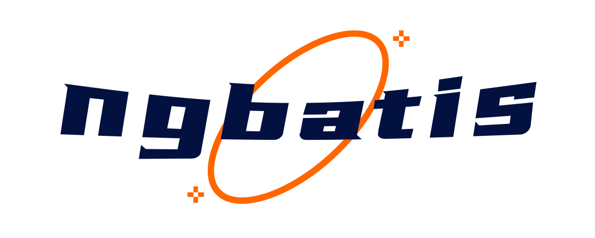

# About Ngbatis

## How to position ngbatis

**NGBATIS**  is a database ORM framework base [Nebula Graph](https://github.com/vesoft-inc/nebula) + springboot. Take advantage of [mybatis'](https://github.com/mybatis/mybatis-3) usage habits to develop. Including some frequently-used  operation in single table and vertex-edge, like [mybatis-plus](https://github.com/baomidou/mybatis-plus).
If you prefer JPA, [graph-ocean](https://github.com/nebula-contrib/graph-ocean) is a good choice.

> If you don't have your own Nebula Graph Database, please arrange it for yourself.  [Lucky Gate](https://docs.nebula-graph.com.cn/3.2.0/4.deployment-and-installation/2.compile-and-install-nebula-graph/3.deploy-nebula-graph-with-docker-compose/)

## Relevant technologies of key steps

- Database：[Nebula Graph](https://github.com/vesoft-inc/nebula)
- Dynamic Proxy Framework：[ASM](https://gitlab.ow2.org/asm/asm/) `v9.4`
- Mapper file parser：[jsoup](https://github.com/jhy/jsoup) `v1.15.4`
- nGQL Template：[Beetl](https://github.com/javamonkey/beetl2.0) `v3.15.10.RELEASE`

## Environmental requirements

- Java 8+
- Springboot

## Authors

    

> Thank you equally to every contributor who has not been recorded due to the inconsistency between the email used for submitting code and the email used for their GitHub account.